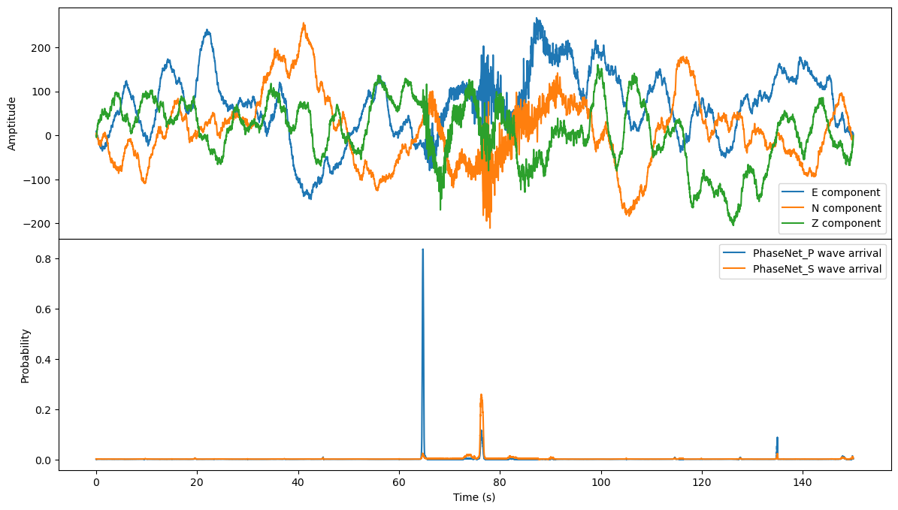
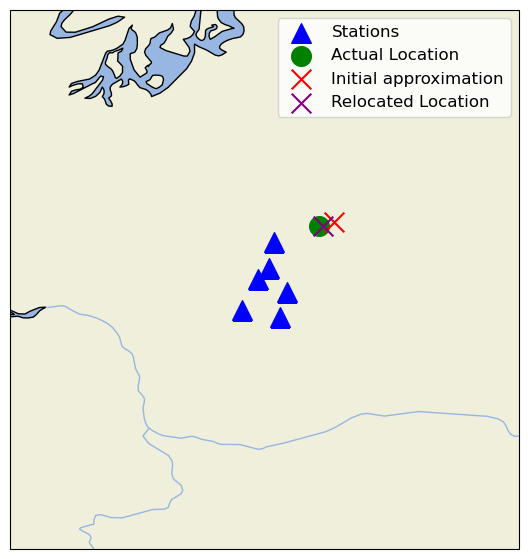

# Artillery Location Detection using Seismic Footprints

This project aims to detect and locate seismic events, specifically artillery detonations, based on their seismic footprints.

## Background

Artillery relies on explosive charges to launch munitions. These detonations transfer energy not only to the munition but also into the ground, creating seismic waves. This project focuses on passive artillery reconnaissance by detecting and locating these detonations using seismic data.

Seismic devices measure the velocity of the Earth’s surface at a predefined sampling rate, typically in three dimensions (North-South, East-West, and Vertical). The data collected by a single device, including all its measurements (traces) and associated metadata, is referred to as a **stream**.

Seismic events, including explosions, generate two primary types of waves:
-   **P-waves (Primary waves):** Faster, compressional waves.
-   **S-waves (Secondary waves):** Slower, shear waves.

Both P-waves and S-waves can be detected by seismic sensors. The task of identifying charge detonations within seismic data can thus be framed as a pattern recognition problem.

## Project Goal

The primary goal is to analyze seismic waves recorded by multiple sensors at different locations. By determining the arrival times of P-waves and S-waves at each sensor, and knowing the sensor locations, we can use localization algorithms to estimate the source of the seismic event (i.e., the artillery location).

This project involves:
1.  Processing a seismic dataset.
2.  Training a Neural Network (NN) model to detect P-wave and S-wave arrivals from seismic waveform data.
3.  Implementing localization algorithms to estimate the event's origin.

## Methodology

### 1. Data Preparation and Preprocessing

-   **Dataset:** The [ComCat](https://github.com/niyiyu/PNW-ML) dataset, containing seismic activity from various sources including explosions and earthquakes, is used.
-   **Filtering:** The dataset is filtered to include only explosion events, as these are the focus of this project.
-   **Train-Test Split:** The data is split into training and testing sets for model development and evaluation.
-   **Data Format:** The data is structured for use with the `SeisBench` library, with metadata stored in a `.csv` file and waveform data in an `.hdf5` file.

### 2. Model Training (PhaseNet)

-   **Model Architecture:** The `PhaseNet` model from the `SeisBench` library is utilized. `PhaseNet` is a deep neural network designed for seismic phase picking (detecting P and S wave arrivals).
-   **Training Data Augmentation:** Several augmentation techniques are applied to the training data to improve model robustness and generalization. These include:
    -   Windowing around phase arrivals.
    -   Random windowing.
    -   Normalization (demeaning and peak amplitude scaling).
    -   Probabilistic labeling of P and S phases.
-   **Training Process:** The model is trained using the PyTorch framework.
    -   **Optimizer:** Adam optimizer.
    -   **Loss Function:** A custom loss function based on cross-entropy/negative log-likelihood is used to penalize incorrect phase arrival time predictions.
    -   The model was trained for 50 epochs.

### 3. Inference and Phase Picking

-   The trained `PhaseNet` model is used to predict P-wave and S-wave arrival times from new seismic data.
-   A helper function `get_maximum_confidence_picks` is used to select the P and S phase picks with the highest prediction confidence from the model's output.

**Example of Model Prediction Output:**

```
Actual P wave: 2009-06-11 21:35:47.220000+00:00
Predicte P wave: 2009-06-11T21:35:47.290000Z

Actual S wave: 2009-06-11 21:35:58.800000+00:00
Predicte S wave: 2009-06-11T21:35:58.850000Z
```



### 4. Event Localization

Once P-wave and S-wave arrival times are determined for an event recorded by multiple stations, localization algorithms are applied:

-   **Initial Approximation (Grid Search):**
    -   A basic grid search algorithm is implemented to find an initial estimate of the event's latitude, longitude, and origin time (`t0`).
    -   This method iterates over a predefined grid of possible locations, calculating theoretical travel times for P and S waves based on a velocity model (e.g., `vp=6.5 km/s`, `vs=3.5 km/s`).
    -   The location and `t0` that minimize the sum of squared residuals between observed and theoretical arrival times are chosen as the initial guess.

-   **Double-Difference (DD) Relocation:**
    -   An iterative earthquake location refinement technique, the double-difference algorithm, is used to improve the initial location estimate.
    -   This method minimizes the difference between observed and predicted travel-time differences for pairs of events recorded at common stations.
    -   It iteratively adjusts the event's latitude and longitude to reduce these residuals.

**Example of Localization Output:**

```
Best location (Initial Approximation): (46.54630303030303, -121.93590909090909)
Minimum error: 0.3321591810559037
Distance between best location and actual location: 5.239728772245121 km

Relocated location (Double-Difference): (46.52974770363203, -121.98265583136882)
Distance between best location and actual location: 1.3309495130639304 km
```



## How to Use

1.  **Setup:**
    *   Ensure Python and necessary libraries (see `requirements.txt`) are installed.
    *   Place the `metadata.csv` and `waveforms.hdf5` files in the `data/` directory.
    *   The trained model weights `phasenet_weights.pth` should be in the `output/` directory.
2.  **Training (Optional):**
    *   Run the `1. train.ipynb` notebook to retrain the `PhaseNet` model. This will save the weights to `output/phasenet_weights.pth`.
3.  **Inference and Localization:**
    *   Run the `2. inference.ipynb` notebook to:
        *   Load the pre-trained model.
        *   Select an event.
        *   Predict P and S wave arrivals using the model.
        *   Perform initial location approximation and double-difference relocation.
        *   Visualize the results.

## Conclusion

This project demonstrates a pipeline for detecting seismic P and S wave arrivals using a trained `PhaseNet` model and subsequently locating the seismic event's origin using grid search and double-difference algorithms. The results show the potential for using seismic data for applications like artillery reconnaissance.
